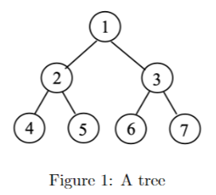

# Assignment 1 - Andrew Chan

## Problem 1 - Adjacency Matrix
Write the adjacency list representation and the adjacency matrix for the following tree:


### Adjacency List
```
1 -> 2 -> 3
2 -> 1 -> 4 -> 5
3 -> 1 -> 6 -> 7
4 -> 2
5 -> 2
6 -> 3
7 -> 3
```
### Adjacency Matrix
```
   1 2 3 4 5 6 7
1 [0 1 1 0 0 0 0]
2 [1 0 0 1 1 0 0]
3 [1 0 0 0 0 1 1]
4 [0 1 0 0 0 0 0]
5 [0 1 0 0 0 0 0]
6 [0 0 1 0 0 0 0]
7 [0 0 1 0 0 0 0]
```
## Problem 2 - BFS and DFS
Demonstrate how the Breadth-First Search (BFS) and the Depth-First Search (DFS) work, respectively. Use the node “q” as the starting node. During the search, when you have multiple choices regarding which node to visit next please use the alphabetical order to choose the next node.
### BFS
q\
~~q~~ s t w\
~~q s~~ t w v\
~~q s t~~ w v x y\
~~q s t w~~ v x y\
~~q s t w v~~ x y\
~~q s t w v x~~ y z\
~~q s t w v x y~~ z\
~~q s t w v x y z~~ \