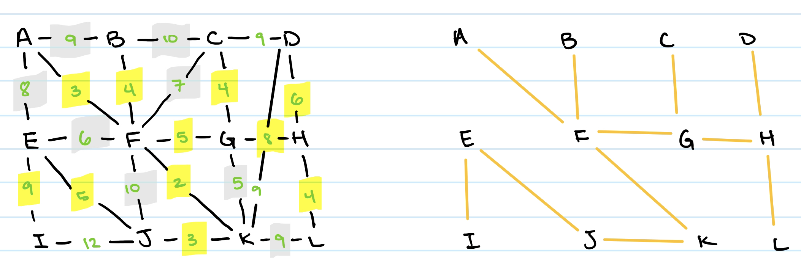

# Assignment 3

## 1 - Minimum Spanning Tree
  
Consider the graph above. You will be building a Minimum Spanning Tree (MST) for this
graph in two ways. When there is a tie on the edge weights, consider the edges or nodes
in alphabetical order. For example, for an edge, this means (A,F) before (B,C), and (C,D)
before (C,G). Show all intermediate steps, and the set of edges contained in the MST.  

(a) Prim’s method:  
Start a arbitrary node A. Then, we can enqueue all of the edges of A into a priority queue. The priority queue would have in order: the from edge, the to edge, and the weight. Since Prim's algorithm works on an undirected graph, we can say that for each edge, there are two edges that point form one node to the next jsut so we can differntiate visited nodes and unvisited nodes. Then, after we find the minimum weighted edge, we can enqueue those edges from that node and finish until we either find a minimum spanning tree or until we determine that the graph is invalid.  
The intermediate steps should look like this:  
```
Enqueue: A, B, 9 
Enqueue: A, E, 8
Enqueue: A, F, 3
Dequeue: A, F, 3 since it has the lowest weight
Create a path between A to F
Current cost: 3
Enqueue: F, B, 4
Enqueue: F, C, 7
Enqueue: F, G, 5
Enqueue: F, K, 2
Enqueue: F, J, 10
Dequeue: F, K, 2 lowest weight
Create a path between F to K
Current cost: 5
Enqueue: K, G, 5
Enqueue: K, D, 9
Enqueue: K, L, 9
Enqueue: K, J, 3
Dequeue: K, J, 3 lowest weight
Create a path between K to J
Current cost: 8
Enqueue: J, E, 5
Enqueue: J, I, 12
Dequeue: F, B, 4 lowest weight
Create a path between F to B
Current cost: 12
Enqueue: B, C, 10
Dequeue: F, G, 5 lowest weight
Create a path between F to G
Current cost: 17
Enqueue: G, C, 4
Enqueue: G, H, 8
Dequeue: G, C, 4 lowest weight
Create a path between G to C
Current cost: 21
Enqueue: C, B, 10
Enqueue: C, D, 9
Dequeue: J, E, 5 lowest weight
Create a path between J to E
Current cost: 26
Enqueue: E, I, 9
Dequeue: G, H, 8 lowest weight
Create a path between G to H
Current cost: 34
Enqueue: H, D, 6
Enqueue: H, L, 4
Dequeue: H, L, 4 lowest weight
Create a path between H to L
Current cost: 38
Dequeue: H, D, 6 lowest weight
Create a path between H to D
Current cost: 44
Deqeueue: E, I, 9 lowest weight
Create a path between E to I
Current cost: 53
Final Minimum Spanning Tree:
A, F, K, J, B, G, C, E, H, L, D, I
Minimum Spanning Tree Cost:
53
```
### Prim's Algorithm Tree:


(b) Kruskal’s method:  
In Kruskal's algorithm, you sort all of the edges in the graph based on their weight. Then add the next smallest weight just so long as the two connected edges don't create a loop.  
The intermediate step should look like this:  
```
F to K weight 2, create path
A to F weight 3, create path
J to K weight 3, create path
F to B weight 4, create path
G to C weight 4, create path
H to L weight 4, create path
E to J weight 5, create path
F to G weight 5, create path
D to H weight 6, create path
G to H weight 8, create path
E to I weight 9, create path
{F-K, A-F, J-K, F-B, G-C, H-L, E-J, F-G, D-H, G-H, E-I}
Minimum Spanning Tree Cost:
53
```
### Kruskal's Algorithm Tree:


## 2 - Edge Relaxation
To solve this problem using edge relaxation, we can use a modified version of Dijktra's Algorithm. We can create a minimum capacity array and set them all to infinity except for the first city which we will set to 0. This is because there is no gas needed to travel to that city since we are starting in the city. We will also maintain a priority queue of cities to be visites, which will initially contain only the start node. At each iteration, we remove the node with the minimum gas-tank from the priority queue. For each neighboring city of the dequeued city 'u', calculate the gas capacity required to travel from u to v as the maximum of the gas tank capacity of u and the weight of the edge. It would look like this:
```minCapacity[v] = max(minCapacity[u] W[u, v])
```
Where minCapacity is the array of gas tank capacity and W is the weights from city u to city v.
