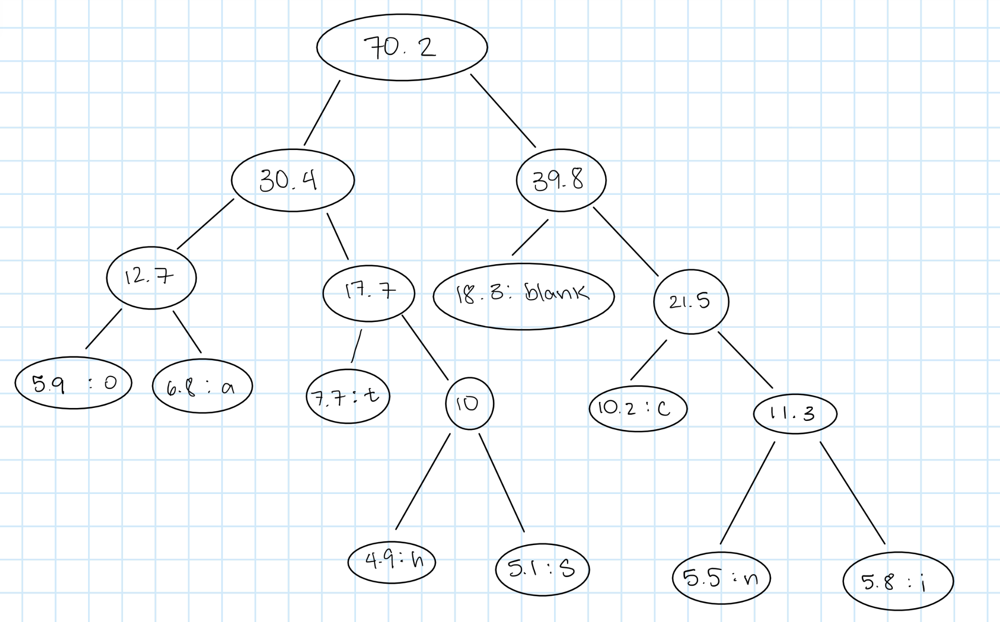
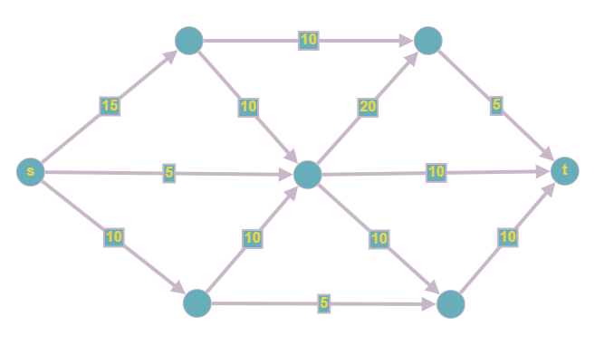
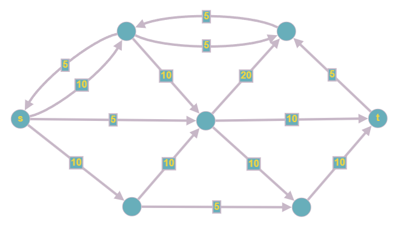
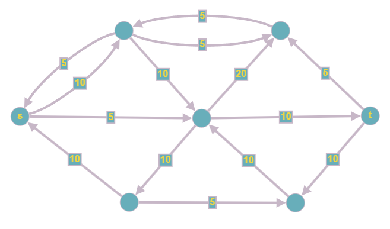
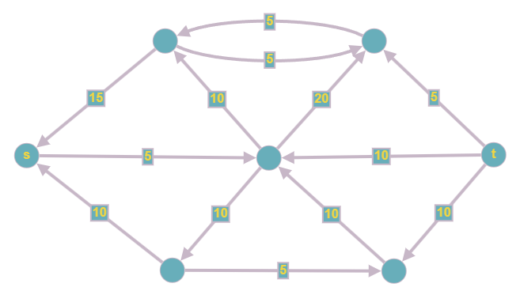

# Assignment 7 - Andrew Chan
## 1 - Huffman
  
Symbol  :   Code  
___     :   10  
e       :   110  
t       :   010  
a       :   001  
i       :   1111  
o       :   000  
n       :   1110  
s       :   0111  
h       :   0110  
## 2 - Supercomputer

a. The Algorithm of Processing Jobs with Shortest Duration First

1. Create a list of all jobs that need to be run on the supercomputer.
2. Compute the total time it will take to complete each job. To do this, add its service time (sk) to its finish time (fi).
3. Next, arrange the jobs in increasing order, based on the total time (ti) obtained from the previous step. This will give us the sequence in which the supercomputer will handle the jobs.
4. Allocate the jobs one by one to the supercomputer. As soon as a job is completed, move on to the subsequent job and allocate it to the computer. This step will be repeated.
b. Evidence of Optimal Efficiency
To demonstrate that the shortest job first approach is the best, let's assume that this strategy doesn't yield the optimal result. We can then take a pair of successive jobs ji and jj in the optimal solution where ji is performed after jj on the supercomputer. Let's also assume that ji takes less time to process on the supercomputer (si < sj).

We can switch the processing sequence of ji and jj without increasing the overall completion time. If we process ji before jj on the supercomputer, the total time for both ji and jj remains the same.

After the swap, the completion time for ji becomes (∑i k=1 sk) + fi, and the completion time for jj becomes (∑j k=1 sk) + fj. Since si < sj, this shows that (∑i k=1 sk) + fi < (∑j k=1 sk) + fj. Consequently, by switching ji and jj, we arrive at a new solution that has a shorter completion time than the previous one. This confirms that the strategy of processing the shortest job first on the supercomputer is indeed the most efficient.

## 3 - Ford-Fulkerson
Figure 1: Flow = 0  

Figure 2: Flow = 5  

Figure 3: Flow = 15  

Figure 4: Flow = 25  

